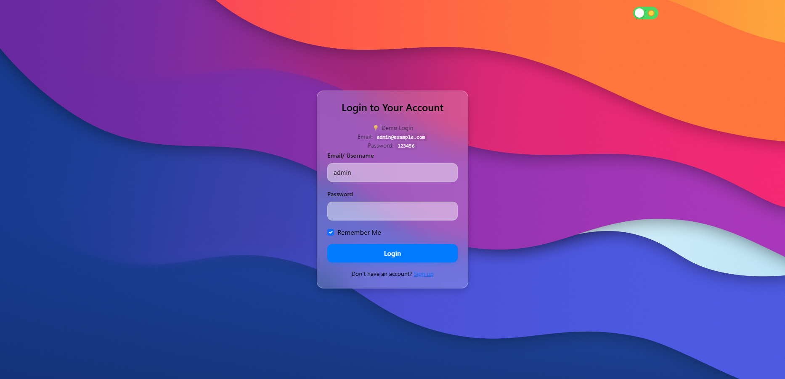
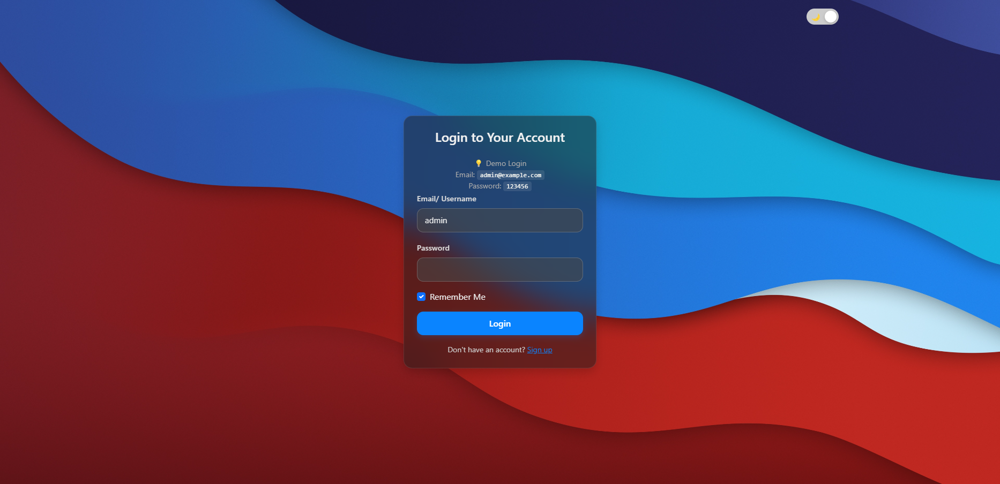
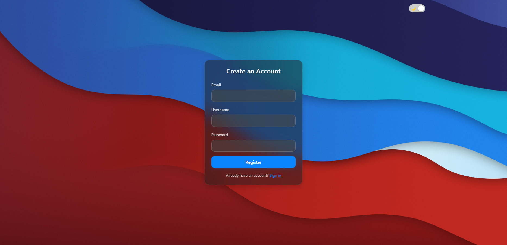

# 💻 MacOS-Style Login Page (HTML + jQuery)

Sebuah halaman login interaktif bergaya MacOS, dibuat hanya dengan HTML, CSS, dan jQuery — tanpa backend. Proyek ini mensimulasikan autentikasi login sederhana dan fitur pendaftaran, dengan tampilan modern dan dukungan tema gelap.

---

## 🧩 Fitur Utama

-   ✅ **Login dan Register Form** dengan validasi dasar
-   🌗 **Light/Dark Theme Toggle** dengan penyimpanan preferensi di `localStorage`
-   🔒 **Remember Me** menyimpan username dan password (simulasi lokal)
-   🧊 **MacOS Glassmorphism Style** dengan efek `backdrop-filter`
-   🪟 Modal notifikasi login/register sukses
-   📱 Desain responsif untuk mobile

---

## 👤 Akun Demo

| Tipe | Username / Email                 | Password |
| ---- | -------------------------------- | -------- |
| Demo | `admin` atau `admin@example.com` | `123456` |

---

## 📂 Struktur Proyek

├── assets/
│ ├── css/
│ │ └── style.css
│ ├── img/
│ │ ├── dark.jpg
│ │ └── light.jpg
│ └── js/
│ └── main.js
├── partials/
│ └── navbar.html
├── index.html
├── .gitignore
└── README.md

---

## ⚙️ Cara Menjalankan

1. **Download/clone** repositori ini
2. Buka file `index.html` menggunakan browser modern (Chrome, Firefox, Opera, dll)
3. Login menggunakan akun demo atau daftar akun dummy (tidak disimpan ke server)

---

## 📌 Catatan Teknis

-   Aplikasi **sepenuhnya frontend**, tidak ada koneksi ke backend.
-   Data login hanya divalidasi dengan data demo (`demoUser`) di JavaScript.
-   Tema terang/gelap disimpan di `localStorage` dan akan bertahan meskipun browser ditutup.

---

## 🛠️ Teknologi yang Digunakan

-   HTML5 + CSS3
-   jQuery (latest)
-   Bootstrap 5 (jika diaktifkan)
-   `localStorage` untuk penyimpanan ringan

---

## 📸 Preview Tampilan

| Light Mode | Dark Mode |
|------------|-----------|
|  |  |
|  |  |

> Jika belum punya screenshot, Anda bisa tambahkan manual di folder `assets/screenshots/`.

---

## 🧑‍💻 Developer

Dibuat oleh **Muhammad Rohid**

📷 Instagram: [@rohid.127](https://instagram.com/rohid.127)

---

## 📄 Lisensi

Proyek ini menggunakan lisensi [MIT](https://opensource.org/licenses/MIT). Bebas digunakan, dimodifikasi, dan disebarluaskan — mohon tetap cantumkan atribusi.

---

## ✅ Rencana Pengembangan (Opsional)

-   [ ] Simpan akun ke JSON dan validasi secara dinamis (untuk pembelajaran lanjut)
-   [ ] Export ke PWA (Progressive Web App)
-   [ ] Tambah animasi login/logout dengan CSS keyframe

---

> Butuh bantuan upload ke GitHub? Saya siap bantu buatkan `git init`, `.gitignore`, dan langkah push-nya.
