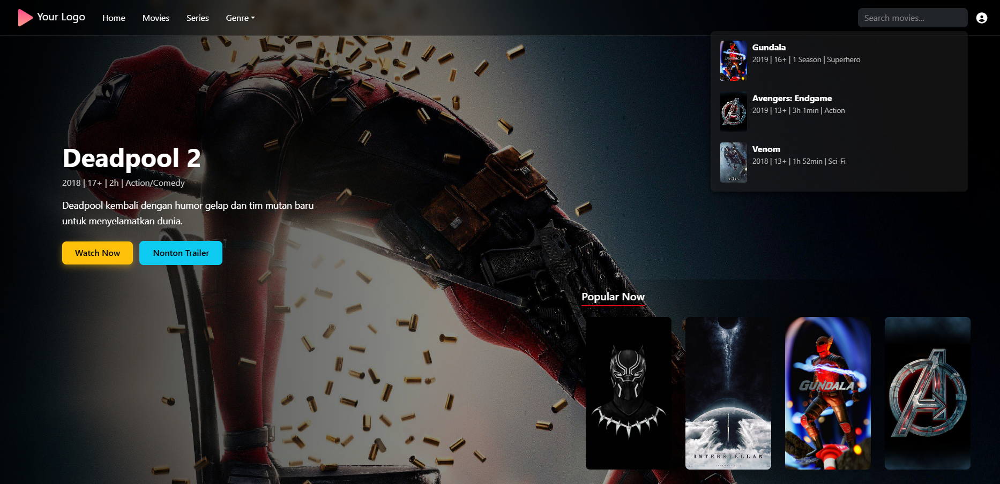
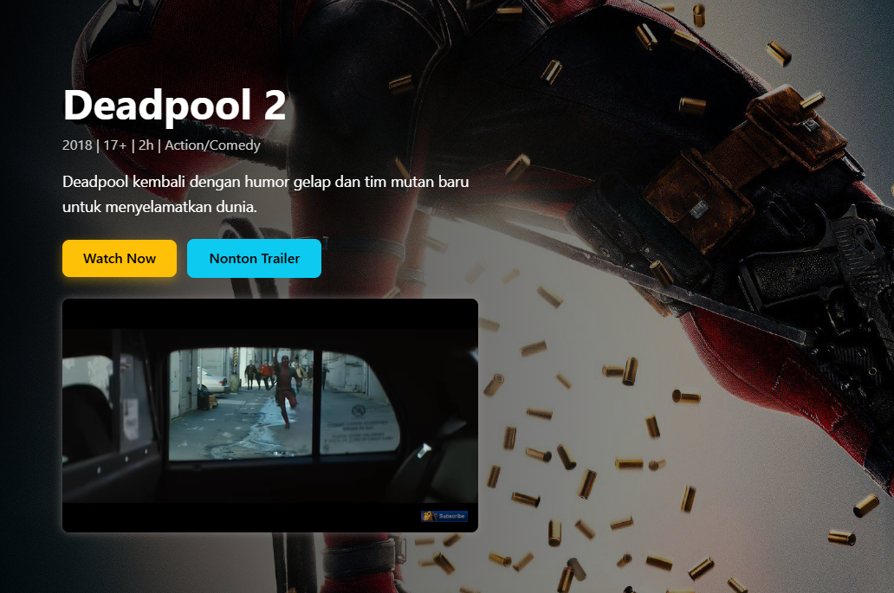
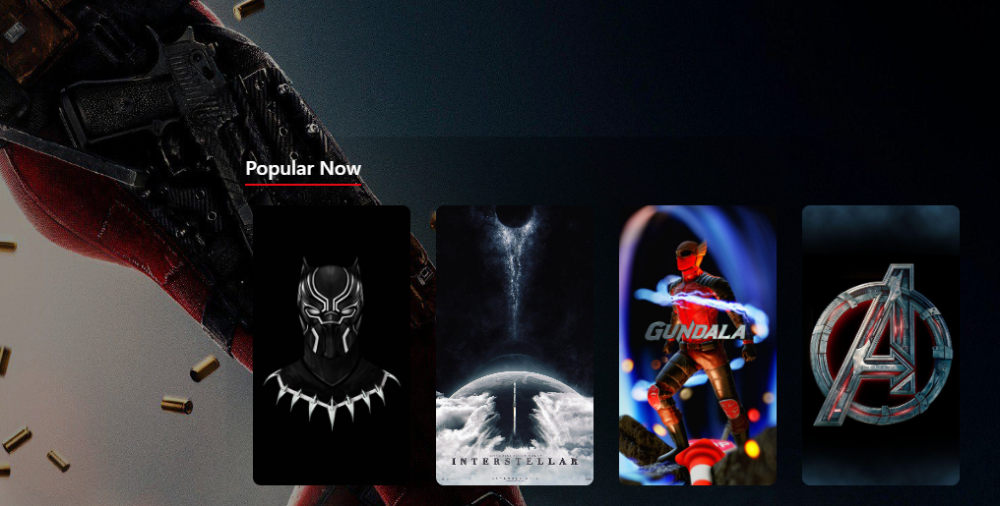

# 🎥 Modern Streaming Web Page (HTML + Bootstrap + jQuery)

A modern and responsive movie streaming web interface built with **HTML**, **Bootstrap 5**, **jQuery**, and **Slick Carousel** — with a stylish design inspired by platforms like Netflix or Disney+. This page includes a hero section, trailer embed, genre navigation, and a dynamic carousel layout.

---

## ✨ Features

- ✅ **Responsive Navbar** with genre dropdown
- 🎬 **Hero Section** featuring a featured movie (Gundala)
- 📺 **Trailer Popup** embedded directly from YouTube
- 🎠 **Popular Now Carousel** powered by Slick Carousel
- 🔍 **Search Bar** with dynamic dropdown suggestion placeholder
- 🌙 **Dark-themed Design** with modern visuals
- 📱 **Fully Mobile Responsive**

---

## 📂 Project Structure

project-root/
├── index.html
├── assets/
│ ├── css/
│ │ └── style.css
│ ├── js/
│ │ └── main.js
│ ├── img/
│ │ ├── gundala.jpg
│ │ └── logo.png
│ └── icons/
│ └── logo.png

---

## 🛠 Technologies Used

- **HTML5**
- **CSS3**
- **Bootstrap 5.3**
- **jQuery 3.7**
- **Slick Carousel**
- **Font Awesome 6**

---

## 🚀 How to Use

1. Clone or download this repository
2. Open `index.html` in any modern browser
3. Explore the interactive UI:
   - Click "Watch Trailer" to load the embedded video
   - Use the navbar and genre dropdown for navigation
   - View carousel content in "Popular Now"

---

## 📌 Notes

- No backend functionality — this is a **frontend-only** simulation
- The trailer uses an iframe and loads dynamically when clicking the trailer button
- The search bar has a dropdown placeholder (`#search-suggestions`) for future implementation
- Designed with responsive grid and dark UI theme for immersive experience

---

## 📸 Screenshots (Optional)

| Hero Section | Trailer Player | Carousel |
|--------------|----------------|----------|
|  |  |  |

> You can add your own screenshots to the `assets/screenshots/` folder to complete this section.

---

## 👨‍💻 Author

Made with ❤️ by **Muhammad Rohid**  
📸 Instagram: [@rohid.127](https://instagram.com/rohid.127)

---

## 📄 License

This project is licensed under the [MIT License](https://opensource.org/licenses/MIT).  
Feel free to use, modify, and share — just credit the author.

---

## 🧠 Future Enhancements (Optional Ideas)

- [ ] Implement real-time search suggestions via JavaScript or API
- [ ] Load carousel content dynamically using JSON
- [ ] Add multiple categories (e.g., Trending, Top Rated)
- [ ] Implement theme switching (light/dark toggle)
